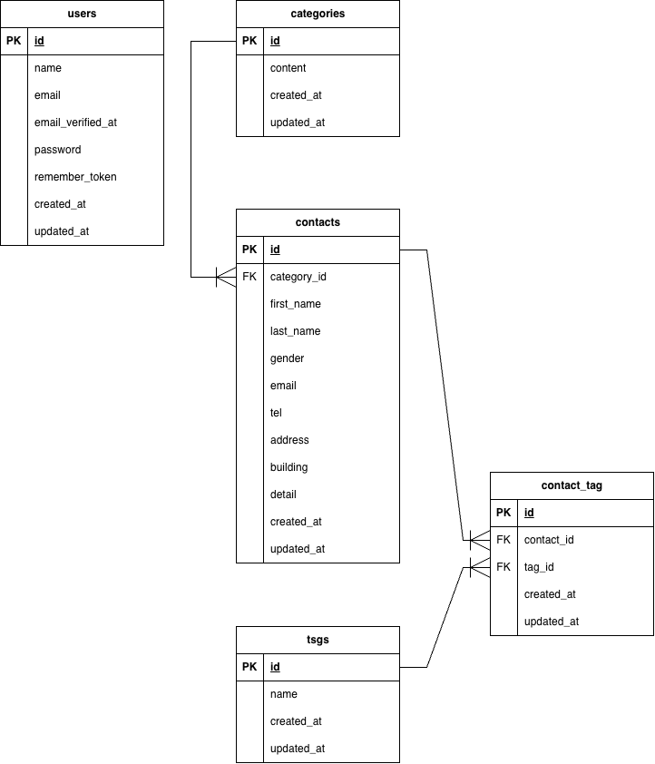

# App Contact Form

<div align="right">
<p><strong>開発者：鴨志田 悟</strong></p>
<p><strong>開発期間：2026年9月6日〜9月13日</strong></p>
</div>

## 概要

お問い合わせフォームのアプリケーションです。下記を実装致しました。

1. 一般ユーザーの入力・確認・完了ページ
2. Fortifyによる管理者の認証画面（登録・ログイン・ログアウト）
3. 管理画面：お問い合わせ内容の一覧・詳細、検索機能、お問い合わせデータの削除、タグのCRUD機能、CSV形式のデータエクスポート機能
4. 公開API：お問い合わせ一覧・詳細のCRUD機能→結果をJson形式で返す。
5. ユーザー・管理者入力に際した各種バリデーション実装

## 使用技術

- PHP 8.2
- Laravel 10.x
- MySQL 8.0
- Nginx
- Vite
- Tailwind CSS
- Docker
- Laravel Sail
- phpMyAdmin
- Fortify

## 開発環境URL

- [phpMyAdmin](http://localhost:8080)

## 動作確認URL

- [お問い合わせ入力画面](http://localhost)
- [管理者登録画面](http://localhost/register)
- [ログイン画面](http://localhost/login)
- [管理画面](http://localhost/admin)

## 環境構築

### 1. Laravelプロジェクトの作成

作業ディレクトリを作成後、Laravel 10.xを指定してプロジェクトを作成

```bash
docker run --rm \
  -u "$(id -u):$(id -g)" \
  -v "$(pwd):/var/www/html" \
  -w /var/www/html \
  -e COMPOSER_CACHE_DIR=/tmp/composer_cache \
  laravelsail/php82-composer:latest \
  composer create-project laravel/laravel:^10.0 app-contact-form
```

### 2. Laravel Sailのセットアップ

DockerコンテナからLaravel Sailをセットアップ

```bash
docker run --rm \
 -u "$(id -u):$(id -g)" \
 -v "$(pwd):/var/www/html" \
 -w /var/www/html \
 -e COMPOSER_CACHE_DIR=/tmp/composer_cache \
 laravelsail/php82-composer:latest \
 composer require laravel/sail --dev
```

MySQLを指定してSailの設定ファイルをパブリッシュ

```bash
docker run --rm \
 -u "$(id -u):$(id -g)" \
 -v "$(pwd):/var/www/html" \
 -w /var/www/html \
 -e COMPOSER_CACHE_DIR=/tmp/composer_cache \
 laravelsail/php82-composer:latest \
 php artisan sail:install --with=mysql
```

**※エイリアスの設定**<br>

1. Sailをバックグラウンドで起動<br>

```bash
./vendor/bin/sail up -d
```

2. エイリアスを設定して 'sail' だけでコマンドを実行できるようにする

```bash
echo "alias sail='[ -f sail ] && bash sail || bash vendor/bin/sail'" >> ~/.zshrc
```

### 3. .env ファイルの設定確認

.envファイルが下記と一致している事を確認する。

```text
DB_CONNECTION=mysql
DB_HOST=mysql
DB_PORT=3306
DB_DATABASE=laravel
DB_USERNAME=sail
DB_PASSWORD=password
```

### 4. PHP / Laravel / MySQLのバージョン確認

確認方法

```bash
sail php --version
sail artisan --version
sail mysql --version
```

> ⚠️ 技術スタックが指定と異なった為、下記要領にてPHP/MySQLを変更

compose.yamlを確認<br>
↓<br>
PHP 8.5 → 8.2<br>
MySQL 8.4 → 8.0<br>
↓<br>
Dockerイメージを再ビルド<br>

```bash
sail down
sail build --no-cache
sail up -d
```

↓<br>
バージョン確認<br>

**MySQLのバージョン変更によるエラー**<br>
MySQL 8.4から8.0へ変更した際、既存のMySQLボリュームに8.4のデータが残っていたため、MySQLのダウングレードエラーが発生。下記コマンドでボリュームを削除し、再構築。

```bash
sail down -v
sail up -d
```

### 5. データベース接続確認

LaravelからMySQLへ接続できることを確認します。

```bash
sail artisan migrate
```

### 6. phpMyAdmin

phpMyAdminをDocker Composeに追加し、ブラウザからMySQLデータベースを確認

**追加したコード（MySQLと同じインデントへ）**

```yaml
phpmyadmin:
    image: "phpmyadmin:latest"
    ports:
        - "${FORWARD_PHPMYADMIN_PORT:-8080}:80"
    environment:
        PMA_HOST: mysql
        PMA_USER: "${DB_USERNAME}"
        PMA_PASSWORD: "${DB_PASSWORD}"
    networks:
        - sail
    depends_on:
        - mysql
```

### 7. フロントエンド環境

提供頂いたbladeファイルに伴い、Tailwind CSS及びAlpine.jsをインストール・設定

**Tailwind CSSのインストール**

```bash
sail npm install -D tailwindcss@^3.4.0 postcss autoprefixer
```

**Alpine.jsのインストール**

```bash
sail npm install alpinejs
```

**Tailwind CSSの設定ファイル作成**

```bash
sail npx tailwindcss init -p
```

**tailwind.config.jsの設定**

```js
/** @type {import("tailwindcss").Config */
export default {
    content: [
        "./resources/**/*.blade.php",
        "./resources/**/*.js",
        "./resources/**/*.vue",
    ],
    theme: {
        extend: {},
    },
    plugins: [],
};
```

**Bladeファイルの配置**<br>
提供されたBladeファイルをresourcesディレクトリへ置換

**Viteの起動**
※Vite：CSSやJavaScriptなどのフロントエンドファイルを監視・ビルドしてくれる開発用サーバー<br>

> ⚠️ 注意点：CSS・JavaScriptなどのフロントエンド処理が発生する場合に、別のターミナルで起動する。

```bash
sail npm run dev
```

## ER図



## Git開発におけるルーティーン

1. Issueの検討<br>

2. mainへ移動<br>
   git switch main

3. mainを最新化<br>
   git pull origin main

4. Issue用ブランチを作成<br>
   git switch -c feature/作業内容

5. 作業<br>

6. 変更点の確認<br>
   git status

7. ステージング<br>
   git add .

8. コミット<br>
   git commit -m "作業内容"

9. GitHubへPush<br>
   git push -u origin feature/作業内容

10. GitHubでPR作成・Merge<br>

11. mainへ戻る<br>
    git switch main

12. mainを最新化<br>
    git pull origin main

13. 作業ブランチを削除<br>
    git branch -d feature/作業内容

## 環境構築後のアプリ制作手順・詰まった所

### 1. migration・model・seederの作成

1. テーブル作成（外部キー・ユニーク制約設定）
2. モデル作成（リレーション設定）
3. Factoryの設定（お問い合わせ20件登録用）
4. 各Seeder及びDatabaseSeederの作成（初期データ投入）
5. テスト、コード品質の確認

> ⚠️ **詰まった所**

1. **１〜３個のタグをランダムに取得し、中間テーブルに登録する。**

```php
$tagIds = Tag::inRandomOrder()
    ->limit(fake()->numberBetween(1, 3))
    ->pluck('id');
$contact->tags()->attach($tagIds);
```

2. **外国人データでseedしてしまった為、config/app.phpを変更した。**

```php
'faker_locale' => 'en_US',
```

↓<br>

```php
'faker_locale' => 'ja_JP',
```

3. **Sail testがFail（HTTPステータス：500）**

事前提供bladeの置換の際、デフォルトのresourcesを削除し、welcome.blade.phpを削除した事により、初期のExample Testが機能しなかった。<br>
→画面実装時にルートとテストを修正する。

### 2. お問い合わせ入力ページの作成

1. `ContactController` を作成
2. blade確認
3. ContactController@index でカテゴリ・タグを取得
4. ルーターの修正
5. 動作確認
6. Feature Testを作成(ステータス、View、categories、tags)
7. テスト、コード品質の確認

> ⚠️ **詰まった所**

1. 動作確認の際、CSSが崩れていた。<br>
   初期にプロジェクトディレクトリ名等を修正した際、指定するディレクトリが変わってしまい、Viteの開発サーバーが起動していなかった事が原因。<br>
   →開発用のプロジェクトディレクトリをコマンドで確認し、再度サーバーを起動。問題解決した。

### 3. お問い合わせ確認・完了ページの作成

1. Form Requestの作成
2. bladeの確認
3. confirm()メソッド実装
4. store()メソッド実装
5. ルーティング
6. 完了ページ：thanks()メソッド実装
7. ブラウザにて動作確認
8. Feature Test：正常系、バリデーションエラー

> ⚠️ **詰まった所**

1. タグが任意項目の為、タグが選択されていない場合を考慮する為、下記にて、tag_idsが存在しない場合には、空配列として処理出来るようにする。<br>

```bash
$validated['tag_ids'] ?? []
```

2. tags_idsは中間テーブル(contact_tag)で使用する事から、お問い合わせ情報を保存後に、下記のコードにて、タグを紐付ける。

```bash
$contact->tags()->attach($validated['tag_ids'] ?? []);
```

### 4. 管理者認証（登録・ログイン・ログアウト）

1. Laravel Fortifyをインストール・設定
2. 管理者登録画面・ログイン画面を確認
3. `CreateNewUser`で管理者登録処理とバリデーションを設定
4. ログイン試行のレート制限を設定
5. 登録・ログイン後の遷移先を`/admin`に設定
6. 登録・ログイン・ログアウトのFeature Testを実装
7. `sail test`、`sail pint --test`で品質確認

> ⚠️ **詰まった所**

1. Fortifyの設定変更後も、ログイン・登録後に`/home`へ遷移する問題が発生した。<br>
   →`RouteServiceProvider`やセッションの状態を確認し、キャッシュクリア・セッション削除を行って動作を確認した。
2. 翻訳ファイルの設定

- `lang/ja/auth.php`：認証関連のエラーメッセージを日本語にする
- `lang/ja/validation.php`：バリデーションエラーメッセージを日本語にする

### 5. 管理画面一覧と検索

1. 管理画面 `/admin` の作成
2. 認証済みユーザーのみ管理画面へアクセス可能
3. お問い合わせ一覧の表示
4. 検索機能実装
5. ページネーション
6. 検索条件のバリデーション
7. 管理画面のFeature Test

> ⚠️ **詰まった所**

1. 動作確認の際に、/register→/homeに自動変更となるトラブルが発生致しました。キャッシュクリアやシークレットモードでブラウザを開く等試しましたが、改善されませんでした。そこで、下記調査し、最終的にセッションファイルを削除する事で動作確認を完了致しました。<br>

→設定ファイル（RouteServiceProvider）を確認した所、下記の記載を確認。<br>

```php
public const HOME = '/home';
```

→設定やセッションの状態を確認し、以下のコマンドでLaravelのキャッシュをクリアしました。<br>

```bash
sail artisan optimize:clear
```

→ファイルセッションを使用していたため、必要に応じてセッションファイルも削除しました。

```bash
sail artisan optimize:clear
```

2. 複数の検索条件

入力された場合だけクエリに条件を追加する必要があり、下記コードで検索条件が入力されている場合のみ検索処理を実行出来るようにした。

```php
$request->filled('keyword')
```

### 6. 管理画面詳細と削除機能

1. お問い合わせ詳細表示・削除機能のルーティングを実装
2. Admin Controllerへshow()メソッドを追加<br>
   関連データを纏めて取得→admin.showへ渡す。
3. Admin Controllerへdestory()メソッドを追加<br>
   削除後、管理画面の一覧へリダイレクト
4. 動作確認

- `/admin` にアクセスしてお問い合わせ一覧が表示されること
- 「詳細」からお問い合わせ詳細画面へ遷移できること
- お問い合わせの詳細情報が正しく表示されること
- 「一覧に戻る」で管理画面へ戻れること
- 「削除」でお問い合わせを削除できること
- 削除後、管理画面一覧から対象のお問い合わせが消えること

> ⚠️ **詰まった所(復習)**

- `with()`と`load()`の違いについて

| `with()` / `load()` | `with()`             | `load()`              |
| ------------------- | -------------------- | --------------------- |
| タイミング          | モデル取得時         | モデル取得後          |
| 対象                | クエリ               | 取得済みモデル        |
| 主な用途            | 一覧など             | 詳細など              |
| 例                  | `Contact::with(...)` | `$contact->load(...)` |

#### `with()`

**「モデルを取得するときに、リレーションも一緒に取得する」**

```php
$contacts = Contact::with(['category', 'tags'])->get();
```

#### `load()`

**「すでに取得したモデルに対して、後からリレーションを取得する」**

```php
$contact = Contact::find(1);

$contact->load(['category', 'tags']);
```

#### 覚え方

- `with()` → **取得するとき**
- `load()` → **取得した後**

### 7. タグCRUD実装

1. バリデーションの為、StoreTagRequest／StoreTagRequestを実装。<br>
   ※タグのバリデーションルール：必須、50文字以内、一意
2. FormRequestの中に、仕様書指定のmessage()メソッドを実装。<br>

- 未入力の場合：タグ名を入力してください
- 50文字を超えた場合：タグ名は50文字以内で入力してください
- 重複している場合：そのタグ名は既に使用されています

3. TagControllerの実装<br>
   TagControllerにタグのCRUD処理を実装した。<br>
   ※タグ削除時に、下記にて中間テーブルの関連データを削除してから、本体を削除。

```php
$tag->contacts()->detach();
```

4. 管理者認証後操作の為、authミドルウェアグループ内に、resourceを用いてタグCRUD用ルートを実装した。
5. 動作確認

- タグCRUD
- タグ名の未入力エラー
- タグ名50文字超過エラー
- 重複したタグ名の登録エラー
- 未認証ユーザーのアクセス制限
- タグ削除時のcontact_tag関連データ削除

> ⚠️ **詰まった所**

1. 機能テスト実装時に、50文字超過エラーのメッセージ確認にて、PASSしなかった。<br>FormRequestとFeature Testのコードで、半角の差異があり修正→PASSした。
2. 動作確認の際、姓名が逆になっている事が発覚した。<br>
   →画面表示かDB由来と判断し、まずbladeを確認<br>
    ```php
    <input type="text" name="first_name" placeholder="例: 山田">
    <input type="text" name="last_name" placeholder="例: 太郎">
    ```
    bladeに問題無し、データ投入時のエラーと判断。別ブランチ由来のエラーの為、最終チェック時に修正する。

### 8. CSVエクスポート実装

1. CSVエクスポート用のForm Requestを作成

- エクスポート時の検索条件をバリデーション
  | 項目 | ルール |
  |---|---|
  | keyword | nullable / string / max:255 |
  | gender | nullable / integer / in:0,1,2,3 |
  | category_id | nullable / integer / exists:categories,id |
  | date | nullable / date |

2. CSVエクスポート処理を実装

- `ContactController.php` に `export()` メソッドを追加
- お問い合わせデータを取得
- 検索条件絞り込みの設定
- データ取得（新着順）
- CSV形式で出力

3. ルーティングを追加
   認証状態での操作の為、authミドルウェア内へ追加する。

4. コンタクトコントローラーへCSVの出力内容を設定

- UTF-8 BOM付きで出力<br>
  **※Excelで日本語CSVを開いた際の文字化けを防ぐため、CSVの先頭にUTF-8 BOMを付ける。**

```php
fwrite($handle, "\xEF\xBB\xBF");
```

- CSVヘッダーを設定
- 性別を数値から文字列へ変換
- カテゴリをIDからカテゴリ名へ変換

5. Feature Testを追加

- CSVが正常に出力されること
- BOM・ヘッダーを確認
- キーワード検索がCSVに反映されること
- 性別指定のバリデーションエラー確認

6. 動作確認

- ブラウザから検索
- 検索結果を確認
- エクスポートボタンからCSVを出力
- CSVの内容を確認

> ⚠️ **詰まった所**
>
> 1. 動作確認の際、検索機能が機能していない事が発覚した。Issue #12で検索機能を実装した際に、ブラウザ遷移異常トラブルがあり、その時に動作確認が漏れてしまった事が本エラーの原因の為、Issueに立ち返っての実装を今後注意する。<br>
>    他ブランチのトラブルだが、CSVエクスポートの動作確認に必要な為、本ブランチ内での修正とした。<br>
>    原因は`AdminController.php`の下記のコードと判明した。<br>

```php
if ($request->filled('gender')) {
    $query->where('gender', $request->gender);}
```

ブラウザの検索時URLを確認すると、`gender=`で止まっており、上記コードでは<br>

```php
$query->where('gender', 0);
```

が実行されてしまう。<br>
従い、下記に変更した所、検索機能は正常になった。<br>

```php
if ($request->filled('gender') && $request->gender != 0) {
    $query->where('gender', $request->gender);}
```

2. CSVをHTTPレスポンスとして生成してダウンロードする仕組み
   **StreamedResponse**<br>
   CSVなどのデータをレスポンスとしてストリーム出力するための仕組み
   **php://output**<br>
   サーバー上のファイルではなく、HTTPレスポンスの出力先へ書き込む
   **fputcsv()**<br>
   配列のデータをCSVの1行として出力する
